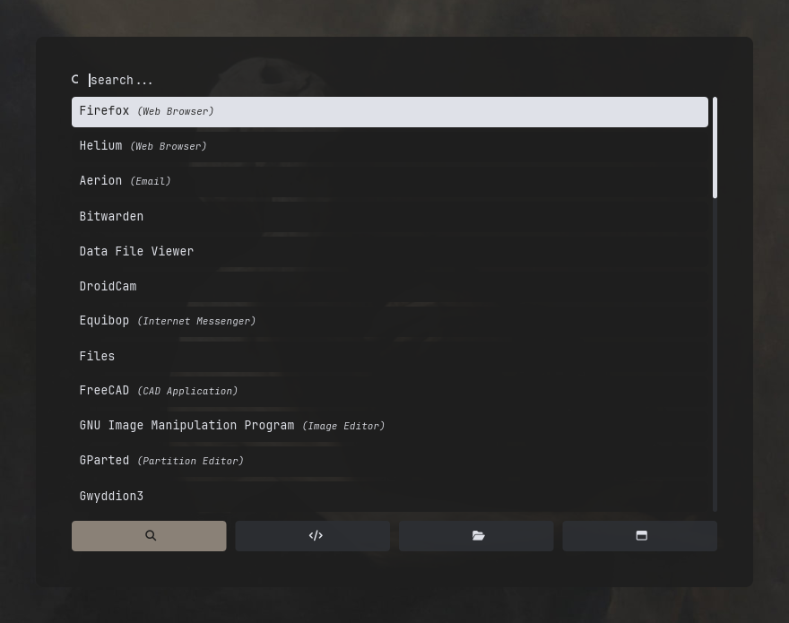

# sieb

A fast, scriptable picker for Wayland. dmenu at heart, rofi where it
counts.



That launcher is four nu scripts and a theme file. No modes are built in.

```nu
fd | sieb                                   # pick a file
ls | to json -r | sieb --text name          # pick a record, get it back whole
sieb --script examples/power/power.nu       # a menu that is a script
```

- **Streams.** Rows are pickable the moment they arrive. 440k lines of
  nushell's source rank in 0.6 seconds.
- **Runs rofi scripts unchanged.** Same protocol, same `ROFI_*`
  variables, Pango markup in rows. JSON when a script prefers it.
- **Modes are just scripts.** Pass `--script` four times and get four
  buttons.
- **Themes in TOML.** Every key is also a flag, so a script can carry its
  own look.
- **No toolkit.** One binary that draws its own panel with tiny-skia and
  matches with [nucleo](https://github.com/helix-editor/nucleo).

## Install

```nu
nix run github:kronberger-droid/sieb -- --help
```

Or `cargo build --release` with `xkbcommon` and `fontconfig` available
through `pkg-config`. sieb needs a compositor with `wlr-layer-shell`,
such as niri or sway. GNOME lacks it.

## Docs

- [dmenu use](docs/dmenu.md): flags, JSON input and keys
- [Scripts and modes](docs/scripts.md): the rofi protocol, markup, modes
- [Theming](docs/theming.md): the config file and its keys
- [Examples](docs/examples.md): the launcher, a power menu, streams
- [Pinentry](docs/pinentry.md): password prompts for rbw and gpg-agent

## License

[MIT](LICENSE)
